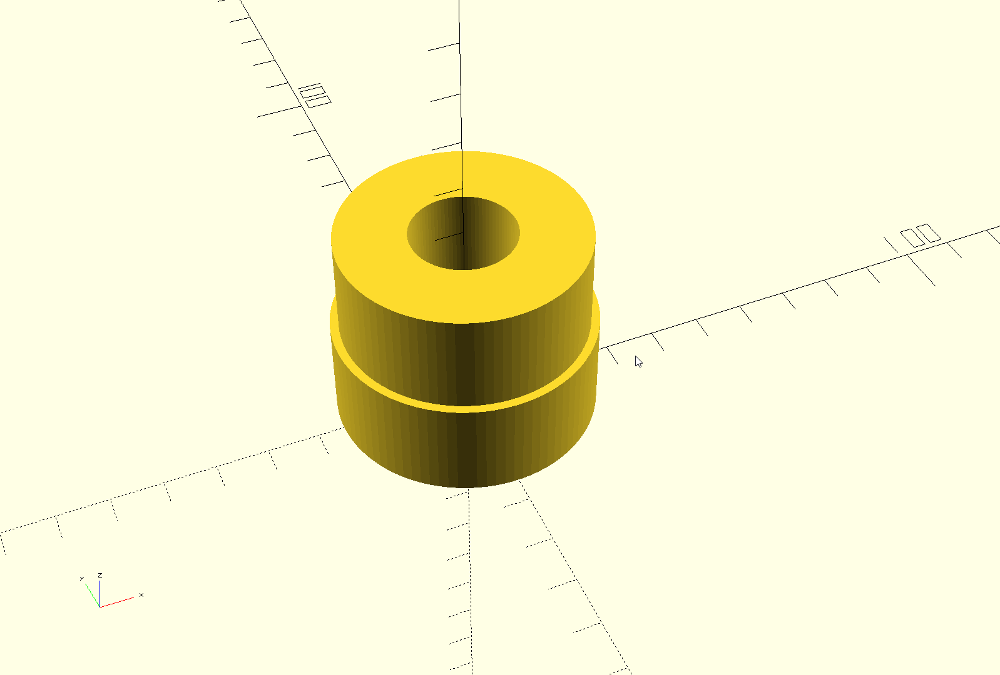

# Land Rover 2.25l bearing drift

Also compatible with 200/300tdi and 2.5TD models.

Allows for safe removal of cam shaft bearings at home.
Only used/tested on front cam bearing.

Recommend settings for Cura: Triangles infill at 15% with
5 line count on walls and roofs.

**Note:** Check for ovality in your printed model. If any exists,
you can either sand the drifter down to fit in the cam bearing
hole in the block or adjust your printer. I had to sand 0.33mm
off my print due to bad ovality.

## Versions

- v1: Inner diameter of bearing based on diameter of block journal and thickness of new bearing.
- v2 (used personally): Inner diameter based on measurement of old bearing in situ. Shortened height.
- v3: Add fitment subtract of 0.15 to help with any ovality.
