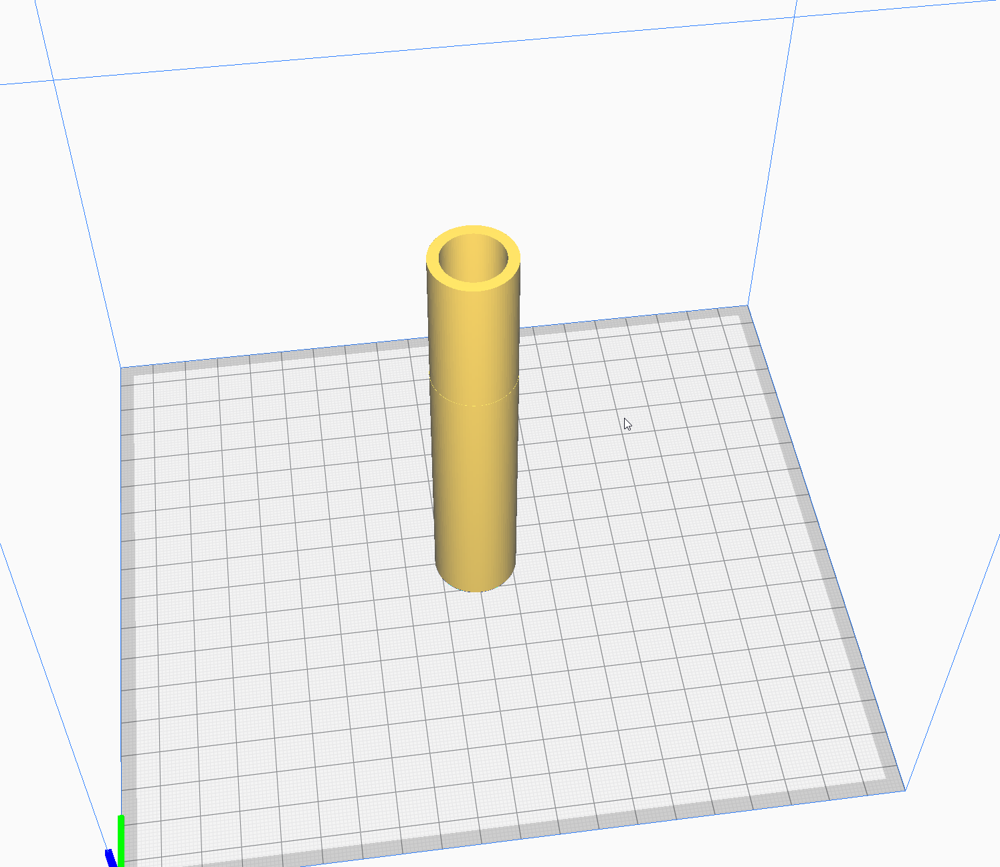

# Land Rover 2.25l clutch alignment tool

Allows for alignment of the clutch plate inside its housing
when replacing the clutch.

Simply put the slightly thinner end through the clutch
plate, and then place it in situ on the brass bushing inside
the flywheel. You can remove it once the pressure plate has
been installed.
