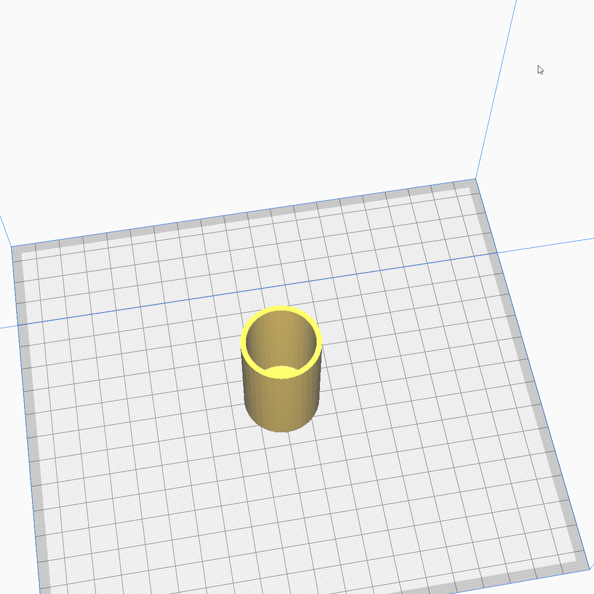

# LT76 Transfer case selector cover shroud

You will need two of these.

Fits tightly over the metal selector cover protecting
the 4wd and transfer range levers on the front of the
lt76 transfer case. They should be filled with grease
and pressed over as far as they can go. Ideally, they
should be painted to make them more impermeable to
water.

These are useful if your selector cover is rusted or
filled with holes.

Modelled in Meshmixer.
