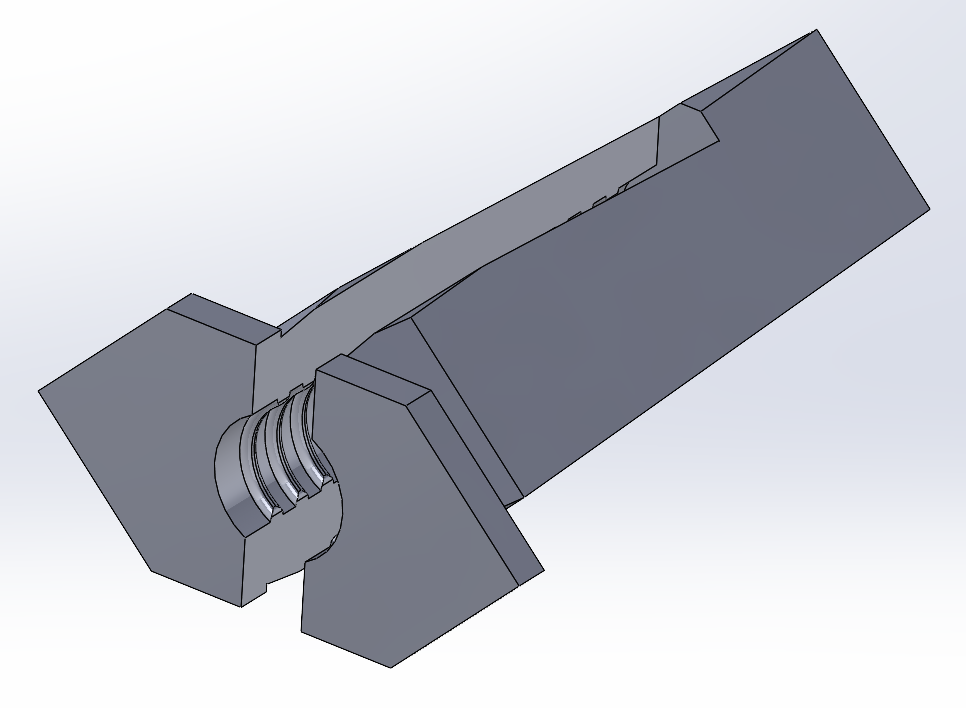

# Series 3 Dashboard grommets

Used to screw the dash board into the bulk head.

These grommets are pushed into the bulk head and
provide a rawplug-like grommet to screw the dash
board on to the car.

Recommended to print them on their side, as shown
in the photo. This is to ensure the flexible elements
are perpendicular to the layers.
