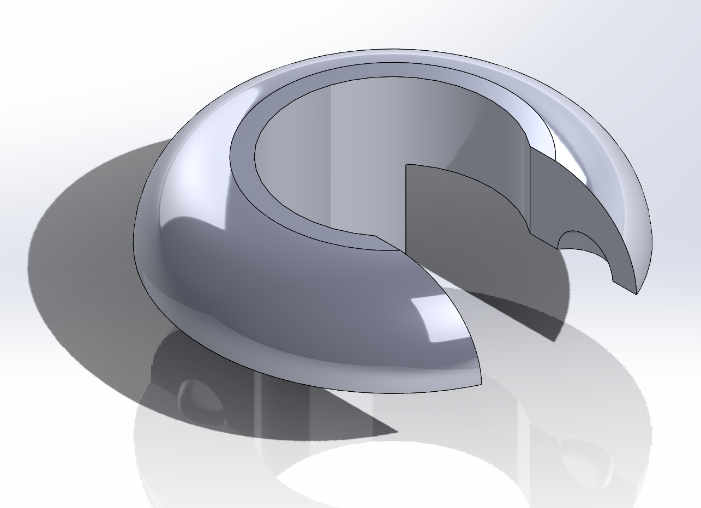

# Series 3 Gear Stick Selector Shaft Washer/Ball

You will need two of these.

Fits into the groove on the late series 3 gear
stick shaft on the gearbox side to provide a snug
fit within the selectors and prevent rattling noises.

The model forms one half of a clam shell each. They
should be pressed over the gear stick and will snap
together to form a complete donut shape.
